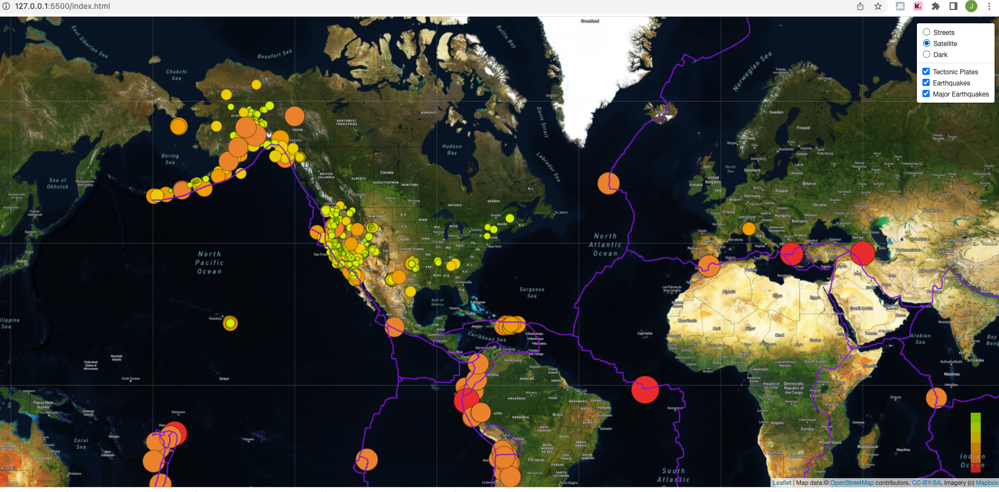
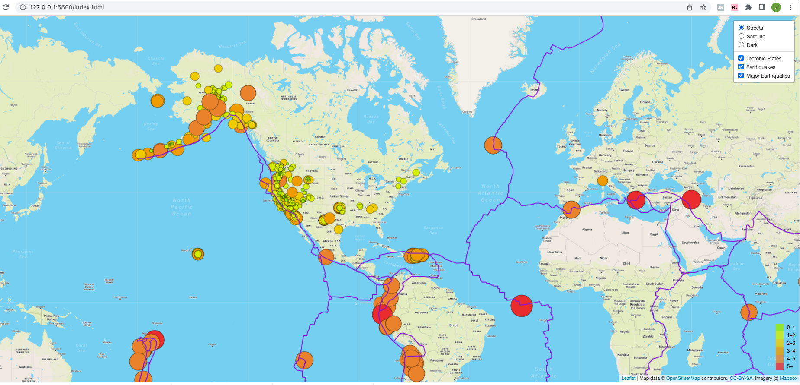
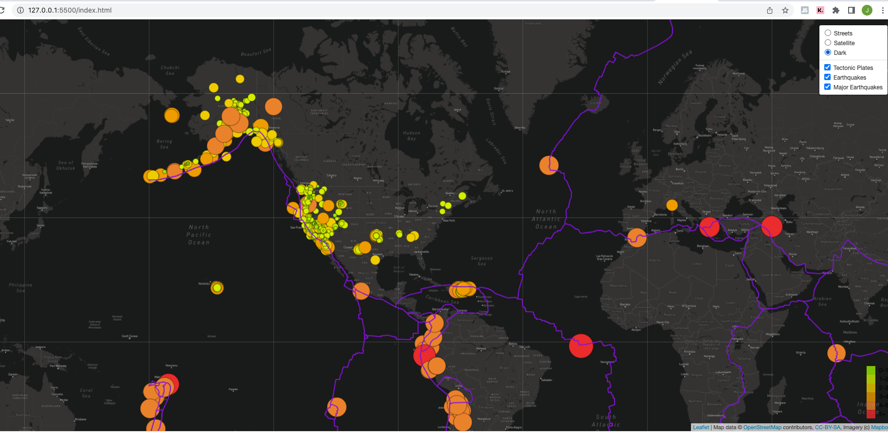
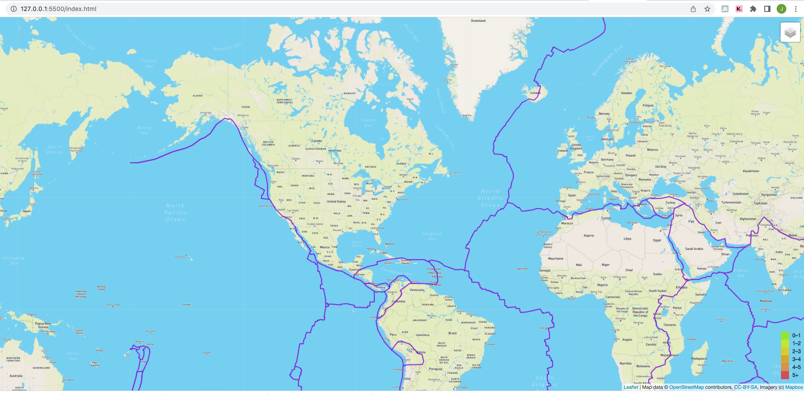

# Mapping Earthquakes

## Overview of the analysis:
The purpose of this project is to visually show the differences between the magnitudes of earthquakes all over the world for the last seven days.  I will also show the earthquake data in relation to the tectonic plates’ location on the earth, and show earthquakes with a magnitude greater than 4.5 on the map.  To accomplish this I have traversed and retreived GeoJSON earthquake data from the USGS website using javascript and the D3 library.  In addition to this I have used the leaflet library to plot the data on a Mapbox map through an API request

## Results:
 * Satellite View
      
 * Streets View
      
 * Dark Mode
      
 * Techtonic Plates
      

 

